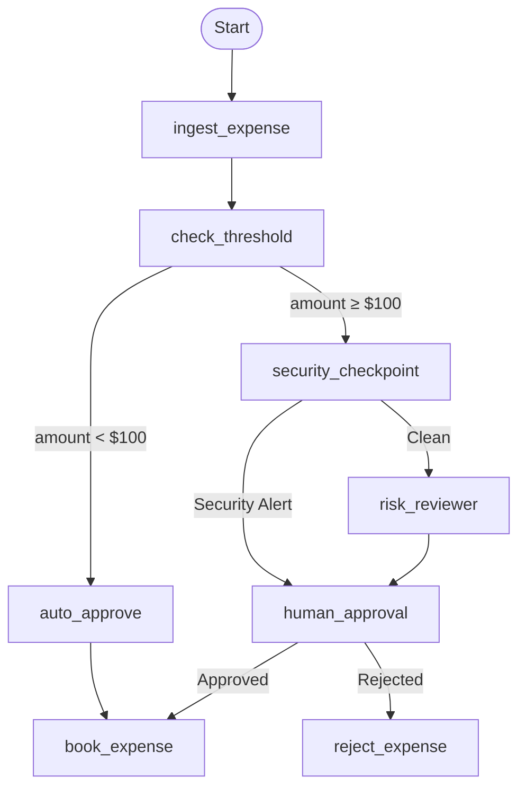

# 💳 Ambient Expense Agent

> AI-powered corporate expense approval system built with **Google Agent Development Kit (ADK) 2.0** using the **Graph Workflow API**.


---

## 🚀 Overview

Ambient Expense Agent automates corporate expense approvals by combining deterministic workflows with AI-assisted decision making.

The agent:

- ✅ Automatically approves low-value expenses
- 🔒 Performs security validation for high-value requests
- 🤖 Uses AI for risk assessment
- 👤 Supports human-in-the-loop approval
- 📊 Ready for evaluation and deployment with Google ADK 2.0

---

## 🏗 Workflow



---

## 🛠 Tech Stack

- Python 3.11+
- Google ADK 2.0
- Graph Workflow API
- Google Agents CLI
- Gemini API
- uv
- Pytest

---

## ⚡ Quick Start

```bash
git clone https://github.com/Prateekdixit200/ambient-expense-agent.git

cd ambient-expense-agent

uv sync

agents-cli install

agents-cli playground
```

---

## 🔑 Environment

Create a `.env` file.

```env
GEMINI_API_KEY=YOUR_API_KEY
```

---

## 📂 Project Structure

```
ambient-expense-agent/

├── expense_agent/
├── deployment/
├── tests/
├── artifacts/
├── README.md
└── pyproject.toml
```

---

## ✨ Highlights

- Google ADK 2.0 Graph Workflow
- Human-in-the-loop Approval
- AI-assisted Risk Review
- Security Checkpoint
- Production-ready Workflow
- Local Evaluation Support
- Google Agent Runtime Deployment

---

## 📄 License

Licensed under the Apache License 2.0.
